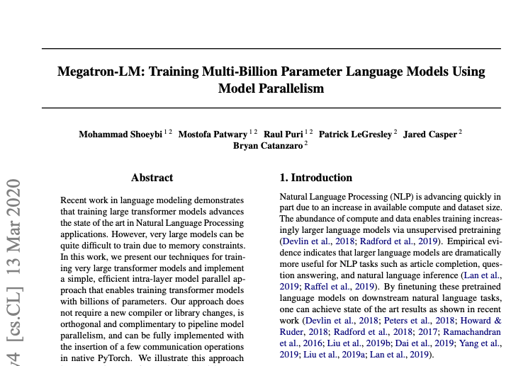
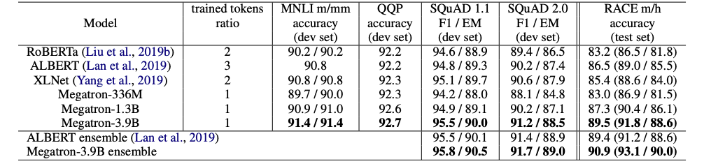

### 问题背景

这是出现在某智慧公司面试中的问题。主动阅读/复现论文能够体现一名工程师对职业的喜爱以及优秀的学习能力。因此在面试中，面试官往往通过你最近所阅读一篇论文来考察。

---

---

### 解题思路

#### 第一步: 找出核心知识点并解析

* 选择一篇最近发表的有影响力的论文:
	* 这里选择2020-3-13英伟达公司发表的Megatron-LM: Training Multi-Billion Parameter Language Models Using Model Parallelism，论文地址: https://arxiv.org/pdf/1909.08053.pdf

---

* 阅读论文后需要总结的点:
	* 1，论文中的主要实验结论是什么
	* 2，阅读论文后对你的启发是什么

---

* 上述论文---Megatron-LM（威震天语言模型）的主要实验结论:

> * 1，利用数据和模型并行的分布式技术训练了具有3.9B(3.9亿)参数的BERT-large模型，起名为Megatron-3.9B，在GLUE的很多数据集上都取得了SOTA成绩。

> * 2，利用数据和模型并行的分布式技术训练了具有8.3B(8.3亿)参数的GPT-2语言模型，并在数据集Wikitext103，LAMBADA，RACE都上取得SOTA成绩(最佳成绩)。

---

* 上述论文---Megatron-LM（威震天语言模型）对我们的启发:
	* 上述的大型模型能够在短时间内训练完成并取得SOTA成绩，一方面体现了算力的重要性，另一方面体现了模型并行（分布式）和数据并行技术关键性。这两项优化技术在加速模型训练和推断过程中至关重要。

#### 第二步: 整合核心知识点形成答案

!!! done "答案"
    最近看了一篇英伟达公司发表的Megatron-LM，该篇论文共有两个主要的结论：1，利用数据和模型并行的分布式技术训练了具有3.9B(3.9亿)参数的BERT-large模型，在GLUE的很多数据集上都取得了SOTA成绩。同时，还训练了具有8.3B(8.3亿)参数的GPT-2语言模型，并在数据集Wikitext103，LAMBADA，RACE都上取得SOTA成绩(最佳成绩)。通过这篇论文，一方面体现了算力的重要性，另一方面体现了模型并行和数据并行技术关键性。这两项优化技>术在加速模型训练和推断过程中至关重要。     

---

