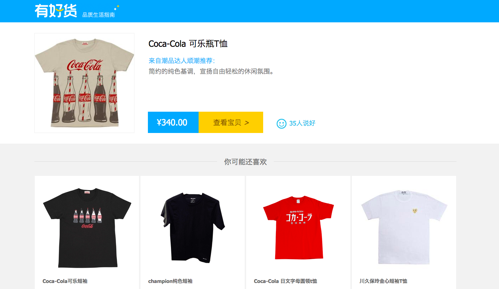

### 问题背景

这是出现在某聘公司笔试中的问题。可见该公司正在计划实现或改进该项推荐业务，并希望通过该问题验证面试者对"猜你喜欢"类型推荐系统的了解程度，是否能够清晰阐述该系统的总体设计架构，以及用户请求过程中系统的运转方式。

---

---

### 解题思路

#### 第一步: 找出核心知识点并解析

* "猜你喜欢"类型的推荐:
>	* 这是推荐系统中一种常见的类型，往往在用户浏览或购买指定商品后，以一个或多个推荐位的形式出现。

---

* 一般推荐系统的设计架构:
>	* 召回-排序架构是一般推荐系统的主流架构。推荐系统首先根据不同的召回策略，如：新热召回，速度召回，协同过滤等召回item，此时item数量相对推荐位来讲仍然可能过载并且无序，就需要排序模型进行排序，取出指定数量的topN显示。在这个过程中，还将加入一些审核规则对item进行过滤，防止重复推荐（推荐同一商品）或过度推荐（一次性消费商品的相关推荐）。

---

#### 第二步: 整合核心知识点形成答案

    "猜你喜欢"类型的推荐系统设计仍然符合一般推荐系统的主流设计架构: 召回-排序架构。根据更具体的业务场景，设计推荐系统的召回策略，不限于新热召回，速度召回，协同过滤等，之后为了避免出现重复推荐或过度推荐，应加入浏览或已购商品的过滤器，最后使用排序模型进行排序，取出指定数量的topN以匹配推荐位数量。

---

<!--

### 问题拓展

* 简述feed流推荐系统的设计方案
* 说一说具体的召回策略和排序模型的选择

---

-->
