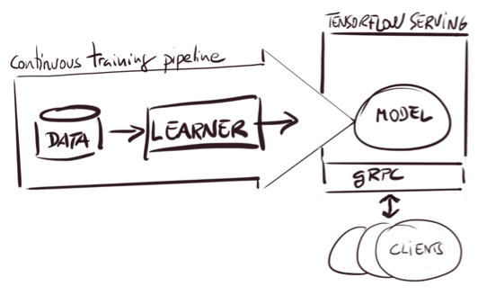

### 问题背景

这是出现在某送公司面试中的问题。模型部署是模型使用的重要环节，其中热更新更是模型部署的硬性标准，因此，考察如何保证模型在部署时能够热更新非常重要。

---

---

### 解题思路

#### 第一步: 找出核心知识点并解析

* 不同框架模型的部署方案:
	* pytorch框架：一般模型为.pth文件，可以使用flask框架进行封装部署。
	* tensorflow/keras框架：一般是.pb或.h5文件，一般使用tensorflow-serving进行封装(.h5可以转换成.pb)。

---

* 模型热更新:
	* 在使用表现更好的模型替换原有的模型时，需保证模型服务不能中断。

---

#### 第二步: 整合核心知识点形成答案

    在我们项目中，使用pytorch训练的模型，部署时使用flask框架搭建服务，为了保证模型能够热更新，这里一般启动两个相同的服务，使用nginx中的backup功能，需要更换模型时，只暂停一个服务进行更换，另一个服务继续工作。使用tensorflow训练的模型，部署时使用tensorflow-serving，自带模型热更新功能。    

---

